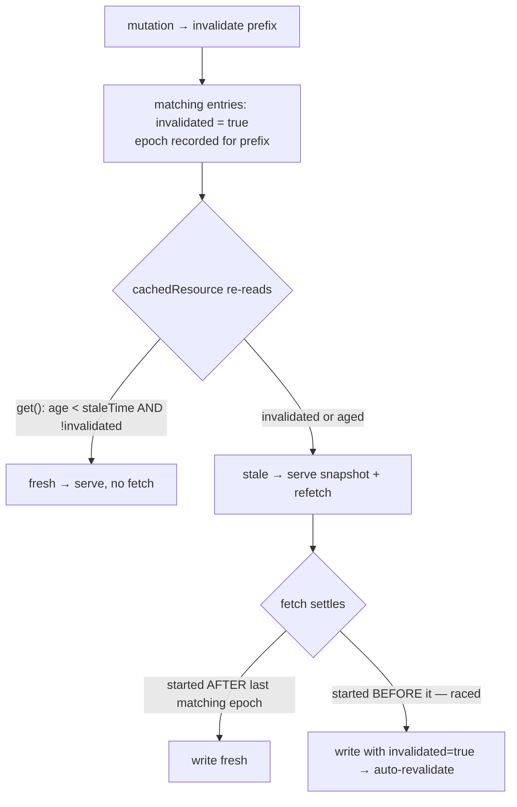

# Instruction: Invalidation redesign — per-entry flag + invalidation epochs

## Architecture projection

> Tree of the final files. ✅ create · ✏️ modify · ❌ delete

```txt
.
├── decision.md                                      ✏️ append D-40 (epoch invalidation, supersedes backdating + dirty/resolved sets)
└── projects/ziflux/src/lib
    ├── types.ts                                     ✏️ CacheEntry gains `invalidated?: boolean`
    ├── data-cache.ts                                ✏️ flag+epoch mechanics; delete #dirtyPrefixes/#resolvedKeys/clearDirty
    ├── data-cache.spec.ts                           ✏️ re-pin invalidation semantics, add override + race specs
    ├── cached-resource.ts                           ✏️ loader settle path uses epoch-aware write
    └── cached-resource.spec.ts                      ✏️ re-pin specs that assumed timestamp backdating
```

## User Journey



## Tasks to do

### `1)` Per-entry `invalidated` flag

> Kill the timestamp arithmetic; freshness = age AND flag.

1. `types.ts`: add `invalidated?: boolean` to `CacheEntry`.
2. `data-cache.ts` `invalidate()`: set `entry.invalidated = true` on prefix matches — no `createdAt` mutation, no deletion. Keep prefix matching, `version`/`_dataVersion` bumps, logger call.
3. `get()`: expired check unchanged (`age > expireTime` → delete); `fresh` becomes `age < staleTime && !entry.invalidated`.
4. `set()`: written entry always has `invalidated: false` (a write is fresh by definition).
5. `inspect()` + `cleanup()`: derive `state: 'stale'` when flagged; no other change.

### `2)` Invalidation epochs replace `#dirtyPrefixes` / `#resolvedKeys`

> One mechanism for "did an invalidation race this fetch": monotonic counter per prefix.

1. Add `#epoch = 0` (plain number) and `#invalidations = new Map<string, number>()` (serialized prefix → epoch).
2. `invalidate()`: `this.#invalidations.set(prefixStr, ++this.#epoch)`. `clear()`: also `++#epoch` under a sentinel matching every key, then clear the map and re-record — or simply record `''` (empty prefix matches all serialized keys via `startsWith('')`… use `'['` to be explicit).
3. In-flight records: replace `staleAtCreation` with `epochAtStart: this.#epoch`. Reuse rule in `deduplicate()`: reuse only when `existing.epochAtStart >= latest matching invalidation epoch for the key`. A cold-cache fetch raced by `invalidate()` is therefore never reused — the race dies here.
4. New internal `_settle<T>(key, data, epochAtStart)`: `set(key, data)`, then if any `#invalidations` prefix matching the key has epoch > `epochAtStart`, set the freshly-written entry's `invalidated = true`.
5. `prefetch()`: capture `epochAtStart` before `deduplicate()`, then `_settle()` — delete its hand-rolled dirty/backdating block.
6. Delete `#dirtyPrefixes`, `#resolvedKeys`, `clearDirty()`, `#isDirty()` entirely.
7. Bound the map: when `#inFlight` empties (in the `finally` cleanup), clear `#invalidations` — epochs only matter while a fetch is in flight. `clear()` also clears it.

### `3)` Wire `cachedResource` loader through `_settle`

> Loader path becomes symmetric with prefetch.

1. `cached-resource.ts` loader: capture `const epochAtStart = cache._epoch` (expose as internal readonly getter) before `deduplicate()`; after await, keep the `'local'`-status guard (D-34) and the `abortSignal.aborted` guard, replace `cache.set(k, data); cache.clearDirty(k)` with `cache._settle(k, data, epochAtStart)`.

### `4)` Specs + decision log

> Re-pin the contract; the old timestamp behavior is gone on purpose.

1. New specs: (a) `invalidate()` is observed by a `cachedResource` with `staleTime` override LARGER than the cache's (the critical bug); (b) `invalidate()` never deletes even when a per-resource `expireTime` override is smaller than cache `staleTime` (the D-08 mirror edge); (c) cold-cache race — invalidate during initial in-flight load → settled data is flagged invalidated and a revalidation follows; (d) repeated `invalidate()` idempotent; (e) `#invalidations` cleared when no fetch is in flight.
2. Update existing specs that assert backdated `createdAt` or dirty/resolved internals.
3. `decision.md`: append `D-40` — epoch+flag invalidation; states what it supersedes (D-27 dirty machinery, backdating from D-08 implementation) and why D-08's contract (mark stale, never delete) is now enforced structurally.

## Test acceptance criteria

| Task | Acceptance criteria                                                                                                                                       |
| ---- | --------------------------------------------------------------------------------------------------------------------------------------------------------- |
| 1    | After `invalidate(['k'])`, a `cachedResource` with `staleTime: 120_000` on a cache with default 30s refetches on next read; entry survives (never deleted) even with a smaller per-resource `expireTime`. |
| 2    | Cold cache + invalidate during in-flight initial load → the settled value is served as stale and a background revalidation fires; pre-mutation data is never readable as fresh. |
| 3    | Loader and `prefetch()` share the settle path: both flag raced writes; `clearDirty` no longer exists in the public or internal API.                          |
| 4    | Full suite green (`pnpm test`), including re-pinned invalidation specs; `decision.md` contains D-40.                                                        |
