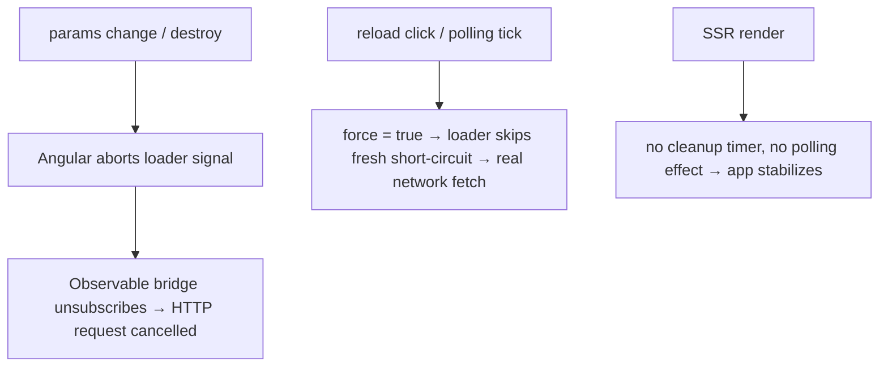

# Instruction: Resource lifecycle — abortable Observables, reload() force, SSR timer guards

## Architecture projection

> Tree of the final files. ✅ create · ✏️ modify · ❌ delete

```txt
.
├── CLAUDE.md                                        ✏️ amend the literal firstValueFrom rule (abort-aware bridge)
├── decision.md                                      ✏️ append D-41 (abort bridge), D-42 (reload/polling force), D-43 (browser-only timers)
└── projects/ziflux/src/lib
    ├── data-cache.ts                                ✏️ cleanupInterval timer gated by isPlatformBrowser
    ├── data-cache.spec.ts                           ✏️ server-platform spec
    ├── cached-resource.ts                           ✏️ abort-aware Observable bridge; force-reload flag; polling gated + forcing
    └── cached-resource.spec.ts                      ✏️ abort, reload-force, polling-interval, server specs
```

## User Journey



## Tasks to do

### `1)` Abort-aware Observable bridge

> `firstValueFrom` never unsubscribes on abort; replace it with a local helper.

1. In `cached-resource.ts`, add `#abortableFirstValue<T>(obs: Observable<T>, signal: AbortSignal): Promise<T>` (module-private function): pre-aborted signal → reject `signal.reason ?? DOMException AbortError` (same pattern as `retryWithBackoff`); subscribe with `next` → unsubscribe + resolve; `error` → reject; `complete` without emission → reject rxjs `EmptyError` (parity with `firstValueFrom`); `abort` event (`{ once: true }`) → unsubscribe + reject AbortError; remove the abort listener on settle.
2. Replace `isObservable(result) ? firstValueFrom(result) : result` with the helper (Promise branch unchanged). Drop the now-unused `firstValueFrom` import.
3. `CLAUDE.md`: reword the rule to "bridge Observable → Promise in loaders via the abort-aware first-value helper (no Subjects/Observables for state)". `decision.md`: D-41 with the why (HttpClient cancellation).

### `2)` `reload()` and polling actually hit the network

> The JSDoc contract is right; make the code match it.

1. In `cachedResource`, add a closure flag `let force = false`. Extract `const forceReload = () => { force = true; const started = res.reload(); if (!started) force = false; return started }`.
2. Loader first line becomes: `if (!force && entry?.fresh) return entry.data` then `force = false` before fetching.
3. Returned ref's `reload` and the `refetchInterval` effect both call `forceReload`.
4. Specs: (a) `reload()` within `staleTime` triggers a real loader fetch; (b) with `refetchInterval: 3_000` and `staleTime: 5_000`, each tick fetches (no ~6s quantization); (c) `reload()` returning `false` (already loading) leaves no dangling force.

### `3)` Browser-only timers

> Copy the platform gate the devtools component already uses.

1. `data-cache.ts` constructor: gate the `cleanupInterval` `setInterval` behind `isPlatformBrowser(inject(PLATFORM_ID))`.
2. `cached-resource.ts`: create the `refetchInterval` effect only when platform is browser (capture `isPlatformBrowser` once at call time — `cachedResource` already requires an injection context).
3. Specs with server `PLATFORM_ID`: no timer scheduled, no polling effect; `decision.md` D-43.

## Test acceptance criteria

| Task | Acceptance criteria                                                                                                                              |
| ---- | ------------------------------------------------------------------------------------------------------------------------------------------------ |
| 1    | An Observable loader's teardown runs when params change mid-flight and on `destroy()`; a pre-aborted signal never subscribes at all.              |
| 2    | `reload()` during the fresh window performs a network fetch; polling at 3s with staleTime 5s fetches every ~3s; suite green.                       |
| 3    | Under server `PLATFORM_ID`, `cleanupInterval` and `refetchInterval` schedule nothing; browser behavior unchanged.                                  |
