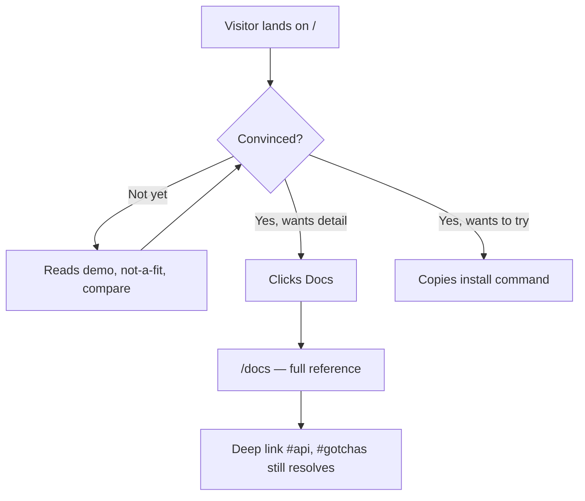

# Instruction: Route split

Move the reference sections to `/docs` and leave the evaluation sections on `/`.
Structure only: no section is rewritten in this phase, they are relocated intact.
Both routes must build, and every anchor that exists today must still resolve.

## Architecture projection

```txt
docs/
├── src/
│   ├── app/
│   │   ├── page.tsx                    ✏️ keeps evaluation sections only
│   │   ├── layout.tsx                  ✏️ metadata moves per-route
│   │   └── docs/
│   │       ├── page.tsx                ✅ reference route
│   │       └── layout.tsx              ✅ docs chrome wrapper
│   ├── components/
│   │   ├── landing/                    ✏️ keeps hero, demo, not-a-fit, prior-art, ai-skills
│   │   ├── docs/                       ✅ new home for the reference sections
│   │   │   ├── quickstart.tsx          ✏️ moved from landing/
│   │   │   ├── guide.tsx               ✏️ moved from landing/
│   │   │   ├── freshness.tsx           ✏️ moved from landing/
│   │   │   ├── scenarios.tsx           ✏️ moved from landing/
│   │   │   ├── advanced-usage.tsx      ✏️ moved from landing/
│   │   │   ├── testing.tsx             ✏️ moved from landing/
│   │   │   ├── api-reference.tsx       ✏️ moved from landing/
│   │   │   └── gotchas.tsx             ✏️ moved from landing/
│   │   └── shared/                     ✅ used by both routes
│   │       ├── navbar.tsx              ✏️ moved, 11 anchors → route links
│   │       ├── footer.tsx              ✏️ moved
│   │       ├── code-block.tsx          ✏️ moved
│   │       ├── copy-button.tsx         ✏️ moved
│   │       └── callout.tsx             ✏️ moved
│   └── lib/
│       └── page-to-markdown.ts         ✏️ must work on either route
└── public/
    └── sitemap.xml                     ✏️ two URLs
```

## User Journey



## Wireframe

```txt
Screen A — "/"                          Screen B — "/docs"
┌──────────────────────────────┐        ┌──────────────────────────────┐
│ (1) Header · Docs · npm · GH │        │ (1) Header · Docs · npm · GH │
├──────────────────────────────┤        ├───────────┬──────────────────┤
│ (2) Hero                     │        │ (9) Side  │ (10) Reference   │
├──────────────────────────────┤        │  Guide    │   Guide          │
│ (3) Demo                     │        │  Caching  │   Caching        │
├──────────────────────────────┤        │  Cases    │   Use cases      │
│ (5) Not a fit                │        │  Patterns │   Patterns       │
├──────────────────────────────┤        │  Testing  │   Testing        │
│ (6) Compare                  │        │  API      │   API            │
├──────────────────────────────┤        │  Gotchas  │   Gotchas        │
│ (8) Footer                   │        ├───────────┴──────────────────┤
└──────────────────────────────┘        │ (8) Footer                   │
                                        └──────────────────────────────┘
```

1. Header shared by both routes; the 11-anchor list collapses to a `Docs` link.
2. Hero, unchanged in this phase.
3. Demo, unchanged in this phase.
5. Not-a-fit, unchanged in this phase.
6. Compare, unchanged in this phase.
8. Footer shared.
9. Sidebar placeholder in this phase; phase 3 makes it real.
10. Reference sections, relocated intact.

## Tasks to do

### `1)` Carve out the shared layer

> Components used by both routes must live somewhere neither owns.

1. Create `src/components/shared/`.
2. Move `navbar`, `footer`, `code-block`, `copy-button`, `callout` into it.
3. Update every import. No behavior change.

### `2)` Create the docs route

> `/docs` renders the reference sections, in their current reading order.

1. Create `src/components/docs/` and move `quickstart`, `guide`, `freshness`, `scenarios`, `advanced-usage`, `testing`, `api-reference`, `gotchas` into it.
2. Create `src/app/docs/page.tsx` rendering them in that order.
3. Create `src/app/docs/layout.tsx` holding the docs chrome and its own `metadata` (title, description, canonical).
4. Keep every section `id` byte-identical. They are the anchor contract.

### `3)` Reduce the landing route

> `/` keeps only what serves the 60-second decision.

1. `src/app/page.tsx` renders hero, demo, not-a-fit, prior-art, ai-skills, footer.
2. Do not rewrite any section in this phase. Removal only.

### `4)` Repoint navigation

> The 11-anchor navbar cannot address two routes.

1. Replace the anchor list with a `Docs` link plus the existing npm / GitHub / theme controls.
2. Anchors that now live on `/docs` become `/docs#<id>`.
3. Verify the `IntersectionObserver` active-section logic degrades cleanly when its targets are absent from the current route.

### `5)` Keep the Markdown export working

> `page-to-markdown.ts` scrapes `#main` of one page and rewrites it with four regexes anchored on exact copy strings.

1. Confirm which of the four anchors now sit on which route.
2. Make the extractor operate on whichever route is current, rather than assuming one page.
3. `data-md-visual`, `aria-hidden`, `button`, `svg` and the `.rounded-full` `!` badge strip selectors must keep matching.

### `6)` Fix the crawl surface

> Two routes, one sitemap.

1. Add `/docs` to `public/sitemap.xml`.
2. Give each route its own `title` and `description`; today both would inherit the landing's.

## Test acceptance criteria

| Task | Acceptance criteria                                                                                                |
| ---- | ------------------------------------------------------------------------------------------------------------------ |
| 1    | `pnpm build` and `pnpm lint` pass; no component is imported from `landing/` by the docs route or vice versa.        |
| 2    | `/docs` renders the seven reference sections in order, and every section `id` present before the split still exists. |
| 3    | `/` is under 8 viewport heights and contains no reference section.                                                  |
| 4    | Every navbar link resolves on both routes; no link produces a 404 or a dead anchor.                                 |
| 5    | "Copy page" on each route yields Markdown whose headings match that route, with no raw diagram text leaking in.     |
| 6    | `sitemap.xml` lists both URLs; the two routes report different `<title>` values in the built HTML.                  |
