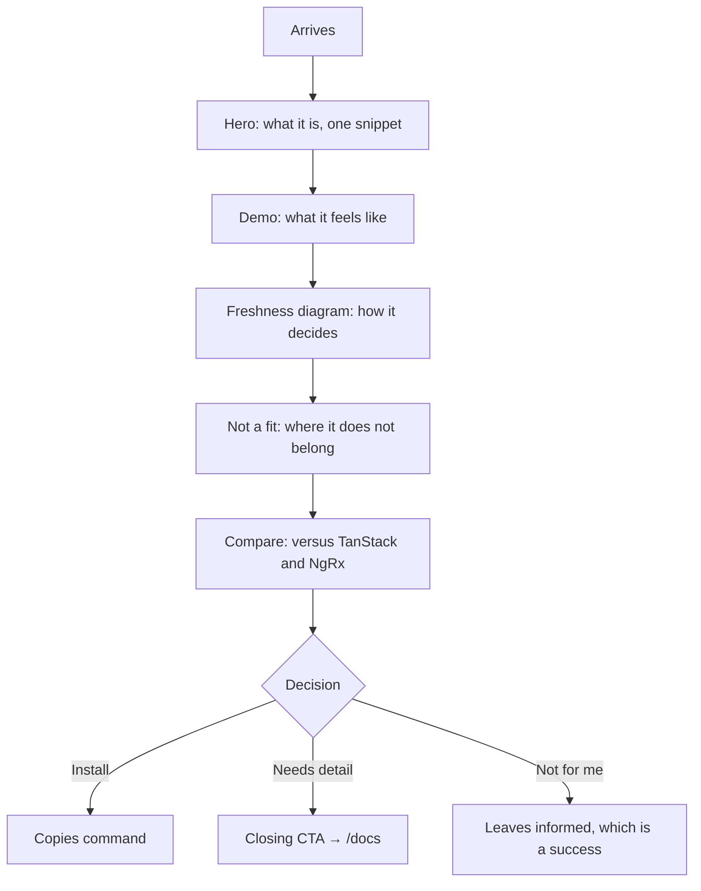

# Instruction: Landing recomposition

Phase 1 relocated sections without touching them. This phase makes `/` actually serve
the 60-second decision: what survives, in what order, and how the visitor leaves for
the docs. This is the phase with editorial judgement in it, so its section split is a
proposal to confirm before executing.

## Architecture projection

```txt
docs/src/
├── app/
│   └── page.tsx                        ✏️ final section order
└── components/
    ├── landing/
    │   ├── hero.tsx                    ✏️ closing CTA gains a docs exit
    │   ├── freshness-summary.tsx       ✅ the three-phase diagram alone
    │   ├── scenarios-summary.tsx       ✅ three titles, no code blocks
    │   ├── closing-cta.tsx             ✅ install + "Read the docs"
    │   ├── not-a-fit.tsx               ✏️ unchanged content, verify rhythm
    │   ├── prior-art.tsx               ✏️ unchanged content, verify rhythm
    │   └── ai-skills.tsx               ✏️ condensed to one line + install
    └── docs/
        ├── freshness.tsx               ✏️ keeps the table, tree and full prose
        └── scenarios.tsx               ✏️ keeps the three code blocks
```

## User Journey



## Wireframe

```txt
┌────────────────────────────────────────────────────┐
│ (1) Header: logo · Docs · npm · GitHub · theme      │
├────────────────────────────────────────────────────┤
│ (2) Hero: title · pitch · install · CTA · snippet   │
├────────────────────────────────────────────────────┤
│ (3) Demo (navigations | mutations)                  │
├────────────────────────────────────────────────────┤
│ (4) Freshness: FRESH ─ STALE ─ EVICTED, diagram only│
├────────────────────────────────────────────────────┤
│ (5) When this is the wrong tool                     │
├────────────────────────────────────────────────────┤
│ (6) Compare  ┌────────┬────────┬────────┐           │
│              │TanStack│ NgRx   │ ziflux │           │
│              └────────┴────────┴────────┘           │
├────────────────────────────────────────────────────┤
│ (7) Closing: install · [Read the docs →]            │
├────────────────────────────────────────────────────┤
│ (8) Footer                                          │
└────────────────────────────────────────────────────┘
```

1. Header, shared.
2. Hero, already effective, untouched.
3. Demo, the strongest argument, kept high.
4. Freshness reduced to its diagram; the table, key tree and prose stay in `/docs`.
5. Not-a-fit, the differentiator, stays.
6. Compare, the one place cards are the right affordance.
7. Closing CTA, the exit that does not exist today.
8. Footer, shared.

## Tasks to do

### `1)` Apply the confirmed split

> Settled by the design brief on 2026-07-25. No further arbitration needed.

1. Landing keeps: hero, demo, freshness diagram, not-a-fit, compare, closing CTA.
2. Docs takes: the four-step quickstart walkthrough, full guide, freshness table and key tree, scenario code, patterns, testing, API, gotchas.
3. The install command and the hero's `cachedResource` snippet stay on `/`; they are enough to judge integration cost.

### `2)` Condense freshness

> The three-phase diagram explains the product. The table and key tree explain the API.

1. Extract the diagram into `freshness-summary.tsx` for `/`.
2. Leave the table, key tree and "when to cache" in the docs version.
3. Carry `data-md-visual` onto whichever wrapper now holds each visual.

### `3)` Condense scenarios

> Three named situations persuade; three code blocks teach.

1. `scenarios-summary.tsx` keeps the titles and the pain line, drops the code.
2. Each entry links to its full form under `/docs#scenarios`.

### `4)` Add the closing CTA

> The page currently ends on a section, with no exit.

1. `closing-cta.tsx`: the install command plus a primary link to `/docs`.
2. Restate the scope in one line. The brand's argument is focus, so end on it.

### `5)` Give each section its own treatment

> Twelve sections share one width and one rhythm, which is why none stands out. The
> design brief's anchor is a component datasheet: it states limits before features, and
> a list of limits should look like one.

1. Hero stays generous, it already works.
2. Demo runs wider than the content column. It is the argument, not an illustration.
3. Freshness diagram runs wide; it is a diagram, not prose.
4. Not-a-fit goes tight and tabular. Six limits read as a specification table, not as six cards. This is where the datasheet anchor earns itself, and it retires two of the six remaining identical cards.
5. Compare keeps its three columns; it is the one place cards are the right affordance.
6. Closing CTA is the drenched moment: the brand orange owns the full section rather than being a 10% accent.
7. No new component library, no new dependency.

## Test acceptance criteria

| Task | Acceptance criteria                                                                                         |
| ---- | ------------------------------------------------------------------------------------------------------------ |
| 1    | `/` carries only the six confirmed sections; the quickstart walkthrough appears solely under `/docs`.        |
| 2    | `/` shows the three-phase diagram; the scenario table and key tree appear only under `/docs`.                 |
| 3    | Each landing scenario entry links to its full version, and the link resolves.                                |
| 4    | The last section before the footer offers both the install command and a working `/docs` link.               |
| 5    | No two adjacent sections share the same content width; not-a-fit renders as a table, not as a card grid.     |
| all  | `/` is at most 6 viewport heights at 1280×820 and reaches the compare block within 4.                        |
| all  | Every contrast pair still passes AA in both themes, measured in the browser, not asserted.                   |
