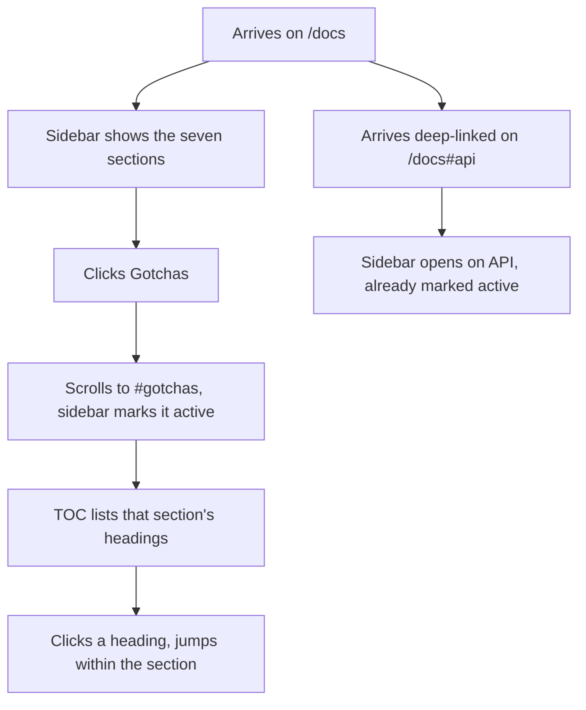

# Instruction: Docs navigation, product register

`/docs` is one long reference page. Without navigation it is the same wall the split was
meant to remove, only moved. This phase gives it a sticky sidebar and a per-page table of
contents, so a reader can reach any section in one click and always know where they are.

It also switches `/docs` to the **product register**, confirmed in the design brief.
`/` persuades, `/docs` serves a task, and they should not share a rhythm. Concretely,
per `impeccable/reference/product.md`:

- **Fixed rem type scale, not `clamp()`.** Fluid headings make no sense in a fixed-width
  content column, and a shrinking h1 next to a sidebar looks worse, not better.
- **Tighter scale ratio**, 1.125 to 1.2 between steps. There are more type elements here
  than on the landing; exaggerated contrast becomes noise.
- **Higher density.** Tighter vertical spacing than `/`; the reader is scanning, not being sold to.
- **A secondary neutral layer** for the sidebar and TOC rails, so they read as chrome
  rather than as content.
- **Shared tokens.** Same colours, same family, same focus treatment as `/`. Different
  rhythm, same site.

## Architecture projection

```txt
docs/src/
├── app/
│   └── docs/
│       └── layout.tsx                  ✏️ three-column shell
├── components/
│   └── docs/
│       ├── sidebar.tsx                 ✅ section list, sticky, active state
│       ├── toc.tsx                      ✅ headings of the current section
│       └── section-heading.tsx          ✅ h2/h3 with a stable anchor id
└── hooks/
    └── use-active-heading.ts            ✅ IntersectionObserver, shared by both
```

## User Journey



## Wireframe

```txt
┌──────────────────────────────────────────────────────┐
│ (1) Header: logo · Docs · npm · GitHub · theme        │
├─────────────┬─────────────────────────┬──────────────┤
│ (9) Sidebar │ (10) Content            │ (11) On this │
│  Guide      │   ## Guide              │      page    │
│  Caching    │   ...                   │   · Stores   │
│ ▸Use cases  │   ## Caching            │   · Keys     │
│  Patterns   │   ...                   │   · Mutations│
│  Testing    │                         │              │
│  API        │                         │              │
│  Gotchas    │                         │              │
├─────────────┴─────────────────────────┴──────────────┤
│ (8) Footer                                            │
└──────────────────────────────────────────────────────┘

Below 1024 px
┌──────────────────────────────┐
│ (1) Header                    │
├──────────────────────────────┤
│ (12) [Sections ▾] collapsed   │
├──────────────────────────────┤
│ (10) Content, full width      │
└──────────────────────────────┘
```

1. Header, shared with `/`.
9. Sidebar, sticky, marks the section in view.
10. Content, the seven reference sections, unchanged from phase 1.
11. TOC of the current section's headings.
12. Under 1024 px both rails collapse into one disclosure above the content.
8. Footer, shared.

## Tasks to do

### `1)` Extract the active-heading logic

> The navbar already runs an IntersectionObserver whose observer only ever sets, never clears.

1. Write `use-active-heading.ts` taking a list of ids and returning the one in view.
2. Fix the never-clears defect: track intersecting entries as a set and pick the topmost.
3. Reuse it in both the sidebar and the TOC. One implementation, not two.

### `2)` Build the sidebar

> Replaces the 11-anchor navbar that phase 1 collapsed.

1. `sidebar.tsx` lists the seven sections, sticky under the header.
2. Mark the active section by more than colour alone; colour-only state fails 1.4.1.
3. Make it a `<nav>` with an accessible name, and keyboard reachable in reading order.

### `3)` Build the table of contents`

> Second-level orientation inside a long section.

1. `toc.tsx` lists the `h3`s of the section in view.
2. Same hook, same active treatment.
3. Hide it under 1280 px rather than cramming three columns.

### `4)` Stabilise heading anchors

> Anchors are a public contract; deep links exist in issues and chats.

1. `section-heading.tsx` renders an `h2`/`h3` with its id and the existing `#` affordance.
2. Keep every id that exists today. Do not regenerate them from titles.
3. `page-to-markdown.ts` line 64 depends on the `Heading <space> #` pattern; preserve it.

### `5)` Switch the docs type scale to product register

> The landing's fluid scale is wrong inside a fixed content column.

1. Replace `clamp()` headings under `/docs` with a fixed rem scale at a 1.125–1.2 ratio.
2. Tighten vertical spacing relative to `/`; the reader is scanning.
3. Give the sidebar and TOC rails a secondary neutral surface so they read as chrome.
4. Change no colour token. The palette is shared, only rhythm and scale diverge.

### `6)` Handle the small-viewport case

> Two sticky rails do not fit a phone.

1. Under 1024 px, collapse the sidebar into a disclosure above the content.
2. Bound its height and let it scroll; the mobile menu already hit this defect once.
3. Keep 44 px touch targets.

## Test acceptance criteria

| Task | Acceptance criteria                                                                                                  |
| ---- | ---------------------------------------------------------------------------------------------------------------------- |
| 1    | Scrolling past the last observed section leaves the correct entry active, not a stale one.                             |
| 2    | Every section is reachable in one click; the active entry is distinguishable without relying on colour.                |
| 3    | The TOC reflects the section in view and updates while scrolling.                                                      |
| 4    | Every `#anchor` valid before this phase still resolves, and "Copy page" still produces correct Markdown.               |
| 5    | No heading under `/docs` uses `clamp()`; `/docs` fits more content per viewport than `/` at the same width.            |
| 6    | At 375 px there is no horizontal scroll, the disclosure scrolls within the viewport, and all targets are at least 44 px. |
| all  | `pnpm build` and `pnpm lint` pass; no focusable element sits inside an `aria-hidden` subtree.                           |
| all  | `/` and `/docs` resolve to the same colour tokens; a diff of the two computed palettes is empty.                       |
