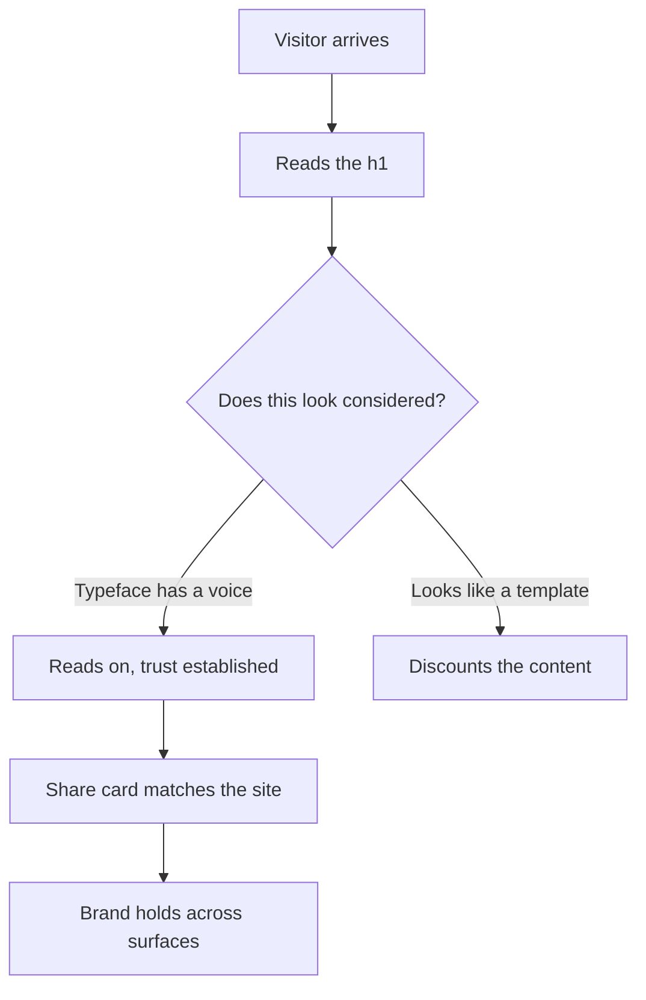

# Instruction: Typography and colour

Phases 1 to 3 fix what the site *does*. This phase fixes what it *is*. The page currently
passes every technical bar while having no point of view: Geist is Vercel's own typeface
on a site whose `PRODUCT.md` names "Vercel-template clones" as an anti-reference, and the
accent is Tailwind `orange-500` verbatim.

Runs last on purpose. It touches every surface, so it lands once the surfaces have stopped moving.

The anchor, from the confirmed design brief, is a **component datasheet**: it states
absolute maximum ratings before features, and it is trustworthy precisely because it
never sells. That is already ziflux's editorial stance, since "When ziflux is the wrong
tool" comes before the guide. The typography should agree with the copy.

## Architecture projection

```txt
docs/
├── src/
│   ├── app/
│   │   ├── layout.tsx                  ✏️ font imports and CSS variable names
│   │   └── globals.css                 ✏️ font vars, accent tokens, type scale
│   └── components/                     ✏️ any hard-coded font-size or tracking
├── public/
│   ├── og.png                          ✏️ regenerate: carries the old orange
│   ├── og.svg                          ✏️ regenerate: source of og.png
│   └── icon.svg / favicon.ico          ✏️ regenerate if they carry the accent
└── src/components/shared/footer.tsx    ✏️ inline logo SVG uses text-accent-*
```

## User Journey



## Tasks to do

### `1)` Swap the type system

> One family with committed weight and width contrast beats a timid display + body pair.

1. Replace `Geist` with `Archivo` and `Geist Mono` with `Sometype Mono`, via `next/font/google` so both stay self-hosted and no external request is added.
2. Rename `--font-geist-sans` / `--font-geist-mono`; the names are wrong after the swap and would mislead the next reader.
3. Re-tune the scale for the new metrics. Archivo's x-height and widths differ from Geist, so line-height, tracking and the h1 `clamp()` ceiling all need re-checking rather than carrying over.
4. Use Archivo's weight and width range for display, instead of introducing a second family.
5. Respect the guardrails: h1 `clamp()` max at or under 6rem, display tracking no tighter than `-0.04em`, body measure 65–75ch.

### `2)` Recompose the accent

> `#f97316` is `orange-500` straight from Tailwind. Nothing about it was chosen.

1. Shift the accent toward a safety orange: redder hue, higher chroma than `oklch(0.7049 0.1867 47.6)`.
2. Re-derive the whole accent family from it: `--accent`, `--accent-strong` (small text, 4.5:1), `--accent-display` (large text, 3:1), `--accent-foreground`.
3. Re-check the status hues against the new accent. `--caution` sits near the accent in hue and the two must stay distinguishable, or STALE reads as branding.
4. Keep the two-tier structure. It is verified and correct; only the base values move.

### `3)` Build the drenched moment

> Restrained everywhere, total in one place. Rare and committed beats diluted.

1. The closing CTA from phase 2 takes the accent as a full-section surface.
2. Derive its foreground from the same tokens; do not hard-code a hex.
3. This is the only drenched section. A second one makes it decoration.

### `4)` Regenerate the brand assets

> The logo and share card carry the old orange. Skip this and the page contradicts its own preview.

1. Regenerate `og.svg`, then `og.png` at 1200×630 from it.
2. Update the inline logo SVG in the footer, which uses the accent token.
3. Check `icon.svg` and `favicon.ico` for the accent.
4. Verify the rendered share card against the live page side by side.

### `5)` Re-verify everything the colour change touched

> The previous session verified 30 contrast pairs. Changing the accent invalidates every pair involving it.

1. Re-run the OKLCH-to-sRGB contrast script over both themes.
2. Measure in the browser as well as from tokens; `getComputedStyle().color` returns `oklch()` in current Chrome and parsing it as RGB silently produces nonsense.
3. Flatten every opacity modifier over its real backdrop, per theme.
4. Check the code-block palette against the new accent: the Catppuccin tokens were chosen next to the old orange.

## Test acceptance criteria

| Task | Acceptance criteria                                                                                                     |
| ---- | ------------------------------------------------------------------------------------------------------------------------- |
| 1    | No `Geist` reference remains in source or built CSS; no font variable is named after a font it no longer holds.            |
| 1    | Headings hold at 320, 768 and 1440 px with no overflow, at every breakpoint, in both routes.                              |
| 2    | No component references a raw hex or a Tailwind palette utility for the accent; everything resolves through a token.       |
| 2    | `--caution` and `--accent` are distinguishable side by side; STALE does not read as a branded element.                     |
| 3    | Exactly one section on `/` uses the accent as its surface.                                                                |
| 4    | The share card and the live hero show the same orange, checked side by side, not assumed.                                 |
| 5    | Every pair passes AA in both themes, reported with measured ratios rather than asserted.                                   |
| all  | `pnpm build` and `pnpm lint` pass. Do not run a build while a dev server is live; they collide in `.next/`.                |
