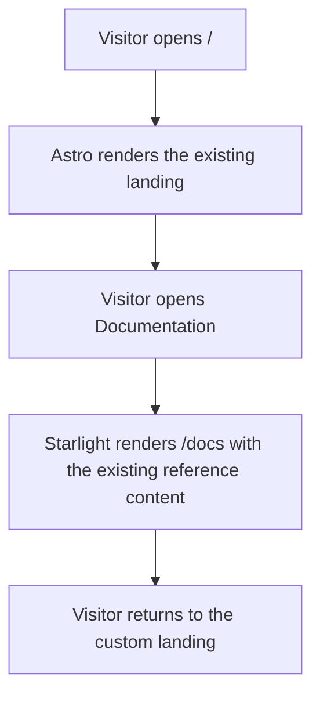

# Instruction: Establish the Astro and Starlight foundation

Replace the Next.js runtime while keeping both public routes and their content available.
The documentation remains a transitional single page in this phase; native page slicing
belongs to phase 2.

## Architecture projection

> Tree of the final files. ✅ create · ✏️ modify · ❌ delete

```txt
docs/
├── astro.config.mjs                       ✅ Astro, React, Starlight, site and sidebar configuration
├── package.json                           ✏️ Astro scripts and dependencies replace Next.js
├── pnpm-lock.yaml                         ✏️ lock the resolved Astro/Starlight graph
├── .gitignore                             ✏️ ignore Astro build and type artifacts
├── tsconfig.json                          ✏️ extend Astro strict TypeScript settings
├── postcss.config.mjs                     ❌ Tailwind 4 runs through its supported Vite plugin
├── next.config.ts                         ❌ no second framework runtime
├── src/
│   ├── content.config.ts                  ✅ Starlight docs collection
│   ├── pages/
│   │   └── index.astro                    ✅ custom landing route
│   ├── content/docs/docs/
│   │   └── index.mdx                      ✅ transitional Starlight documentation route
│   ├── layouts/
│   │   └── marketing-layout.astro         ✅ landing metadata, theme boot and analytics
│   ├── styles/
│   │   └── marketing.css                  ✅ existing landing tokens and Tailwind source
│   ├── app/                               ❌ Next.js route tree
│   └── components/
│       ├── shared/
│       │   ├── navbar.astro               ✅ framework-native marketing navigation and theme control
│       │   ├── footer.astro               ✅ framework-native footer
│       │   ├── navbar.tsx                 ❌ Next.js navigation
│       │   └── footer.tsx                 ❌ replaced by Astro components
│       └── landing/
│           ├── hero.tsx                   ✏️ plain route links, preserved copy interaction
│           ├── freshness-summary.tsx      ✏️ plain route links
│           └── closing-cta.tsx            ✏️ plain route links
```

## User Journey



## Wireframe

```txt
┌────────────────────────────────────────────────────┐
│ (1) Header: ziflux · Documentation · npm · GitHub   │
├────────────────────────────────────────────────────┤
│ (2) Hero: scope · install · docs CTA · code         │
├────────────────────────────────────────────────────┤
│ (3) Interactive cache comparison                    │
├────────────────────────────────────────────────────┤
│ (4) Freshness · limits · alternatives               │
├────────────────────────────────────────────────────┤
│ (5) Closing install and documentation exit          │
├────────────────────────────────────────────────────┤
│ (6) Footer                                          │
└────────────────────────────────────────────────────┘
```

1. Header: existing landing navigation, implemented without Next.js.
2. Hero: existing decision content and working clipboard action.
3. Comparison: existing React island, hydrated only where interactive.
4. Evaluation sections: current order and content.
5. Closing: current install action and `/docs` link.
6. Footer: current license and repository link.

## Tasks to do

### `1)` Bootstrap the replacement runtime

> Astro becomes the only build and routing runtime under `docs/`.

1. Configure Astro, React, Starlight, Tailwind's Vite plugin, the site URL, static output, and the docs collection.
2. Replace Next scripts and TypeScript configuration with Astro equivalents.
3. Lock compatible current versions in `docs/pnpm-lock.yaml`.

### `2)` Port the custom landing shell

> Preserve the current marketing page rather than restyling it during a framework migration.

1. Create the Astro page and marketing layout.
2. Keep React components server-rendered by default; hydrate only clipboard and animated controls.
3. Replace `next/link`, `next/font`, `next-themes`, and Next metadata with Astro-native equivalents.
4. Preserve Vercel Analytics through its Astro entry point.

### `3)` Put the existing reference behind Starlight

> Content must remain reachable while its authoring format changes in phase 2.

1. Register the Starlight collection and a transitional `/docs` MDX entry.
2. Render the existing reference content inside the Starlight page.
3. Configure the initial sidebar, social links, and route back to the landing.

### `4)` Remove the active Next route tree

> Once Astro owns `/` and `/docs`, keeping executable Next routes creates false ownership.

1. Delete `src/app/`, `next.config.ts`, and framework-specific navigation components.
2. Keep legacy documentation components only where the transitional page still consumes them.
3. Confirm the static output is `docs/dist/`.

## Test acceptance criteria

| Task | Acceptance criteria |
| ---- | ------------------- |
| 1    | `pnpm build` and `pnpm check` pass from `docs/`; Astro produces a static `dist/` tree containing `/` and `/docs`. |
| 2    | `/` preserves its current sections, metadata, theme choice, install copy button, animation controls, and links at 320, 768, and 1440 px. |
| 3    | `/docs` is rendered in the Starlight shell and contains every existing top-level reference section and code example. |
| 4    | No build or route imports Next.js, and `next.config.ts` plus `src/app/` no longer exist. |
| all  | Both routes have zero horizontal overflow at 320 px and are keyboard reachable with visible focus. |
