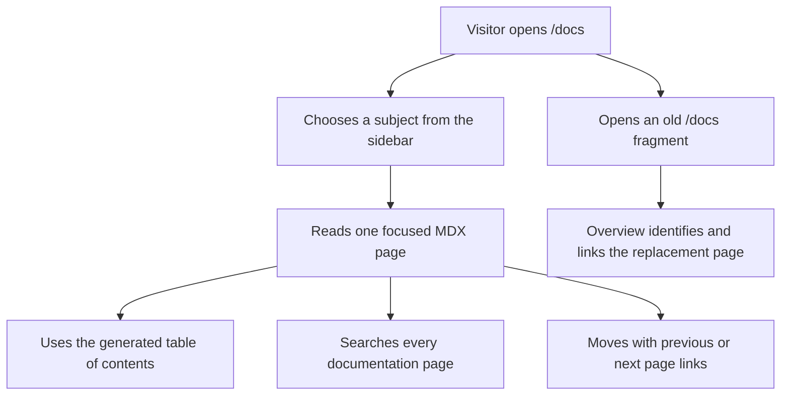

# Instruction: Convert the reference to native Starlight content

Replace the transitional React reference page with a documentation tree whose MDX files
are the source of routes, navigation, headings, search, and page metadata.

## Architecture projection

> Tree of the final files. ✅ create · ✏️ modify · ❌ delete

```txt
docs/src/
├── content/docs/docs/
│   ├── index.mdx                         ✏️ overview and legacy anchor map
│   ├── quick-start.mdx                   ✅ installation and first cached resource
│   ├── guide.mdx                         ✅ domain architecture and recipes
│   ├── caching.mdx                       ✅ freshness, keys and cache selection
│   ├── use-cases.mdx                     ✅ application scenarios
│   ├── patterns.mdx                      ✅ advanced composition patterns
│   ├── testing.mdx                       ✅ TestBed and standalone cache tests
│   ├── api-reference.mdx                 ✅ public API reference
│   └── gotchas.mdx                       ✅ boundary behavior and pitfalls
├── components/docs/
│   ├── visuals/                          ✅ only bespoke diagrams that Markdown cannot express clearly
│   ├── advanced-usage.tsx                ❌ content moves to MDX
│   ├── api-reference.tsx                 ❌ content moves to MDX
│   ├── freshness.tsx                     ❌ content moves to MDX
│   ├── gotchas.tsx                       ❌ content moves to MDX
│   ├── guide.tsx                         ❌ content moves to MDX
│   ├── quickstart.tsx                    ❌ content moves to MDX
│   ├── scenarios.tsx                     ❌ content moves to MDX
│   ├── section-heading.tsx               ❌ Starlight owns anchors
│   ├── sidebar.tsx                       ❌ Starlight owns navigation
│   ├── testing.tsx                       ❌ content moves to MDX
│   ├── toc.tsx                           ❌ Starlight owns the table of contents
│   └── navigation.ts                     ❌ content files own navigation data
├── hooks/
│   ├── use-active-heading.ts             ❌ Starlight owns active headings
│   └── use-active-heading.test.mts       ❌ removed with the hook
└── pages/index.astro                     ✏️ links target the new page routes
```

## User Journey



## Wireframe

```txt
Desktop
┌──────────────────────────────────────────────────────────────┐
│ (1) Header: ziflux · search · GitHub · theme                 │
├───────────────┬────────────────────────────┬─────────────────┤
│ (2) Sidebar   │ (3) Current MDX page       │ (4) On this page│
│  Overview     │  title · description       │  heading links  │
│  Quick start  │  prose · code · diagrams   │                 │
│  Guide        │  previous / next           │                 │
│  Caching      │                            │                 │
│  API          │                            │                 │
└───────────────┴────────────────────────────┴─────────────────┘

Mobile
┌────────────────────────────────┐
│ (1) Header · menu · search      │
├────────────────────────────────┤
│ (3) Current MDX page            │
│  title · prose · code           │
│  page navigation               │
└────────────────────────────────┘
```

1. Header: Starlight global navigation and search.
2. Sidebar: ordered documentation subjects generated from content slugs.
3. Page: one task-oriented subject with native Markdown headings and code blocks.
4. Table of contents: Starlight-generated links for the current page.

## Tasks to do

### `1)` Slice the existing reference by reader task

> Move content, do not silently rewrite product behavior.

1. Create the overview plus eight subject pages in the current reading order.
2. Preserve every code sample, warning, limitation, and API signature.
3. Use Starlight asides, tabs, steps, cards, and Expressive Code before retaining a custom component.

### `2)` Make content own navigation

> Sidebar and table of contents must derive from MDX rather than duplicated arrays.

1. Configure the ordered sidebar from page slugs.
2. Use native Markdown `h2` and `h3` headings with explicit IDs only where the existing public anchor differs.
3. Delete the custom sidebar, TOC, heading observer, and their test.

### `3)` Preserve route contracts

> Fragment redirects are impossible on the server.

1. Keep `/docs` as the overview route.
2. Add meaningful overview targets for `quickstart`, `guide`, `freshness`, `scenarios`, `advanced-usage`, `testing`, `api`, and `gotchas`.
3. Update every landing link to the focused replacement page while leaving old fragments useful.

### `4)` Verify native documentation behavior

> The migration only pays off if Starlight owns the formerly custom behavior.

1. Confirm Pagefind returns results from multiple pages in the production preview.
2. Confirm sidebar, current-page state, table of contents, heading anchors, and previous/next navigation.
3. Confirm Expressive Code copy buttons and all custom interactive visuals remain keyboard operable.

## Test acceptance criteria

| Task | Acceptance criteria |
| ---- | ------------------- |
| 1    | The eight former reference sections exist as focused documentation pages with the same technical claims, code samples, API entries, and warnings. |
| 2    | Sidebar, active page, heading anchors, table of contents, and page navigation work without the deleted custom observer or navigation data. |
| 3    | `/docs` remains valid; every legacy top-level fragment lands on a visible overview target that links to its replacement page; all landing documentation links resolve. |
| 4    | Production search returns matches from at least three different documentation pages; code-copy controls and mobile navigation work by keyboard. |
| all  | Every generated documentation page has one `h1`, no duplicate IDs, no broken internal links, and no horizontal overflow at 320 px. |
