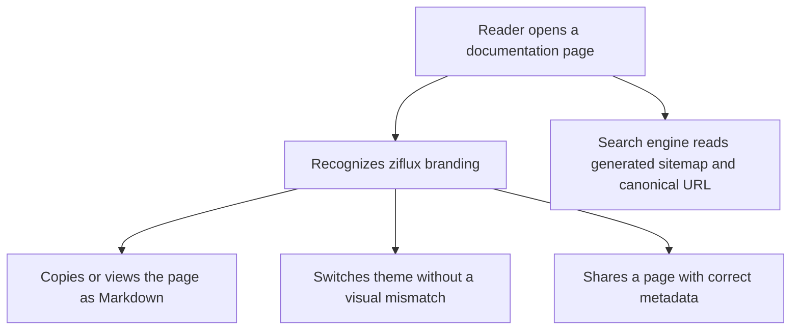

# Instruction: Restore brand parity and remove the legacy stack

Apply the existing ziflux identity through supported Starlight tokens, restore page
actions and metadata, then remove every dependency and source file made obsolete by the
migration.

## Architecture projection

> Tree of the final files. ✅ create · ✏️ modify · ❌ delete

```txt
docs/
├── astro.config.mjs                       ✏️ final branding, plugins, metadata and sidebar
├── package.json                           ✏️ final minimal dependency set
├── pnpm-lock.yaml                         ✏️ no Next.js or abandoned documentation packages
├── eslint.config.mjs                      ❌ Next.js lint configuration
├── README.md                              ✏️ Astro/Starlight commands and content structure
├── public/
│   ├── icon.svg                           ✏️ reused as Starlight logo
│   ├── og.png                             ✏️ shared social image
│   ├── og.svg                             ✏️ shared social image source
│   ├── robots.txt                         ✏️ current sitemap location
│   └── sitemap.xml                        ❌ generated by Starlight/Astro
└── src/
    ├── styles/
    │   ├── marketing.css                  ✏️ landing-only Tailwind and brand tokens
    │   └── starlight.css                  ✅ supported Starlight token overrides
    ├── components/shared/
    │   ├── callout.tsx                    ❌ replaced by Starlight asides
    │   ├── code-block.tsx                 ❌ replaced by Expressive Code
    │   ├── copy-button.tsx                ✏️ retained only for the landing hero
    │   ├── copy-page-dropdown.tsx         ❌ replaced by the Starlight plugin
    │   └── inline-code.tsx                ❌ Markdown owns inline code
    └── lib/
        └── page-to-markdown.ts            ❌ plugin generates clean Markdown pages
```

## User Journey



## Tasks to do

### `1)` Map the brand onto public Starlight tokens

> Keep the safety orange, Archivo/Sometype Mono pair, and measured contrast without forking Starlight components.

1. Load the existing fonts locally through Fontsource packages.
2. Map page, text, border, accent, code, focus, and typography values through custom CSS.
3. Keep the custom landing register separate from the denser documentation register.
4. Avoid internal selectors where a documented Starlight variable exists.

### `2)` Restore page actions and machine-readable content

> Replace the DOM scraper with the listed Starlight plugin.

1. Configure compact copy and view-as-Markdown actions.
2. Disable unrelated AI-chat actions.
3. Generate `llms.txt`, `llms-full.txt`, and clean per-page Markdown from source content.

### `3)` Complete metadata and static deployment

> Astro owns the crawl and deployment surface.

1. Configure canonical site URL, social metadata, favicon, logo, generated sitemap, and robots reference.
2. Keep Vercel Analytics on landing and Starlight pages.
3. Confirm the build needs no Vercel server adapter.

### `4)` Delete the displaced stack

> No Next.js compatibility layer remains after Astro and Starlight pass acceptance.

1. Remove Next.js, next-themes, node-html-markdown, Next ESLint packages, and unused React documentation helpers.
2. Delete obsolete configuration, custom page-export code, custom documentation chrome, and stale tests.
3. Rewrite `docs/README.md` around Astro, Starlight, MDX, `dist/`, and the new commands.

### `5)` Run full acceptance

> Validate the application, not just the compiler.

1. Build and type-check `docs/`, then run the root library typecheck, lint, and tests.
2. Inspect `/` and representative documentation pages at 320, 768, and 1440 px in light and dark themes.
3. Exercise search, page actions, code copy, theme persistence, anchors, sidebar, and keyboard focus.
4. Measure rendered contrast pairs involving the mapped brand tokens.

## Test acceptance criteria

| Task | Acceptance criteria |
| ---- | ------------------- |
| 1    | Landing and Starlight pages use Archivo, Sometype Mono, and the same safety-orange identity; all measured text pairs pass WCAG 2.1 AA in both themes. |
| 2    | Every docs page can be copied and viewed as clean Markdown; AI-chat actions are absent; generated `llms.txt` links resolve. |
| 3    | Canonicals, social image, favicon, robots, generated sitemap, and Vercel Analytics are present in the static build without a server adapter. |
| 4    | No `next`, `next-themes`, `eslint-config-next`, or `node-html-markdown` dependency or source import remains; the docs README describes only the Astro/Starlight workflow. |
| 5    | `pnpm build` and `pnpm check` pass in `docs/`; root `pnpm typecheck`, `pnpm lint`, and `pnpm test` pass. |
| all  | `/` and all `/docs` routes have zero horizontal overflow at 320 px, visible keyboard focus, working theme persistence, and no browser console errors. |
